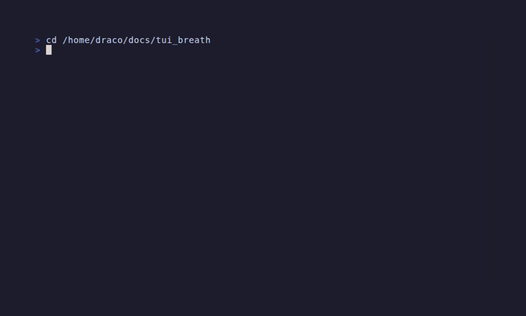

# TUI Breath — Interactive Breathing Guide

A terminal-based breathing guide built in Rust. It walks you through breathing Patterns with a glowing orb, smooth phase transitions, and persistent Session history.

## Installation

```bash
cargo install tui_breath
```

<details>
<summary>Build from source</summary>

```bash
git clone https://github.com/avakado0/tui-breath
cd tui-breath
cargo build --release
./target/release/tui_breath
```
</details>

**Uninstall:** `cargo uninstall tui_breath`



## Features

**Animated Visualization**
- Expanding and contracting glowing orb for breathing Phases
- Smooth color crossfades between inhale, hold, and exhale
- Breath Hold mode with a dedicated lungs-style pixel-art counter
- Typewriter labels and pulsing highlight animation

**Breathing Patterns**
- **4-7-8**: 4s inhale, 7s hold, 8s exhale
- **Box Breathing**: 4s each — inhale, hold, exhale, hold
- **Diaphragmatic**: 4s inhale, 6s exhale
- **Breath of Fire**: Rapid Kapalabhati — passive 0.5s inhale, sharp 0.5s exhale
- **Bhastrika (Bellows Breath)**: Forceful equal breath — 1s inhale, 1s exhale
- **Stimulating Breath**: Rapid 3-part energizer — 0.4s inhale, 0.4s exhale

**Workout Mode**
- Toggle with `w` on the menu to pair breathing with guided body movements
- Press `m` during a session to open the Body Movements screen (pixel-art guided stretches)

**Customization**
- Session duration: 1–100 breathing Cycles
- Breathing speed: 0.5×–2.0× Tempo scaling
- Audio beep on phase transitions via terminal bell (toggle with `b`)

**Session Tracking**
- Persistent JSON storage at `~/.local/share/tui_breath/`
- Saved metrics for Cycles, pauses, completion, and breathing rate
- Attached Breath Hold attempts on the same Session record
- History summary that surfaces the best Breath Hold duration

## Quick Start

Minimum terminal size: **60×24**.

## Controls

| Screen | Key | Action |
|--------|-----|--------|
| Menu | `j/k` `↑/↓` | Navigate patterns |
| Menu | `Enter` | Select |
| Menu | `h` | History |
| Menu | `w` | Toggle Workout Mode |
| Setup | `Tab` | Switch field (Duration / Breathing Speed) |
| Setup | `↑/↓` or `+/-` | Adjust value |
| Setup | `Enter` | Start Session |
| Setup | `Esc` | Back to menu |
| Session | `p` / `Space` | Pause / Resume breathing |
| Session | `h` | Start / End Breath Hold |
| Session | `d` | Deep Inhale Hold (from hold mode; not recorded as attempt) |
| Session | `m` | Open Body Movements (Workout Mode only) |
| Session | `e` / `Esc` | End Session |
| Body Movements | `1/2/3` | Jump to movement |
| Body Movements | `Esc` | Return to Session |
| Results | `f` | Forget saved record, then return to menu |
| Results | `Enter` / `Esc` | Return to menu |
| History | `j/k` `↑/↓` | Navigate saved Sessions |
| History | `Esc` | Back to menu |
| Any | `b` | Toggle beep |
| Any | `q` / `Ctrl-C` | Quit |

## Architecture

```text
src/
├── main.rs              # 30 FPS event loop and animation ticking
├── app.rs               # App state machine and Session sub-mode transitions
├── animator.rs          # Color, label, and pulse interpolation
├── engine/
│   ├── breathing.rs     # BreathingEngine timing and Cycle progression
│   ├── hold.rs          # Breath Hold runtime and attempt summaries
│   ├── patterns.rs      # Pattern and Phase definitions
│   └── session.rs       # SessionManager metrics, status, and event log
├── storage/             # JSON persistence and history index
└── ui/                  # Session, results, history, menu, setup, and body movements rendering
```

The engine owns timing. The animator owns interpolation. The app state machine coordinates breathing mode, Breath Hold mode, and Body Movements mode.

## Testing

```bash
cargo test
```

Coverage includes engine progression, hold runtime behavior, Session-mode transitions, and storage compatibility for older history entries.

## Session Storage

- **Linux/macOS**: `~/.local/share/tui_breath/sessions/`
- **Windows**: `%APPDATA%\Local\tui_breath\sessions`
- Index: `~/.local/share/tui_breath/index.json`

Each saved Session keeps breathing metrics plus optional Breath Hold attempt data, and the history index stores the best hold summary for quick browsing.

### Stored Fields

**Per-session JSON record:**
- `session_id`: Unique UUID identifier
- `start_time`, `end_time`: ISO 8601 timestamps
- `status`: `"completed"` or `"abandoned"`
- `type`: Pattern name (e.g., `"4-7-8"`)
- `parameters`:
  - `duration_target`: Planned cycle count
  - `actual_duration_secs`: Total elapsed time
  - `settings`: Breathing rate, pattern phases, tempo (0.5–2.0×)
- `breath_hold`: Optional hold data with `best_seconds`, `attempt_count`, and full attempt records (timestamp, duration)
- `history`: Full event log with timestamps (phase transitions, pauses, holds)

**History index** (`index.json`) tracks:
- Session metadata for quick browsing
- `cycles_completed`: Actual cycles finished
- `completion_pct`: Percentage of target duration completed
- `best_breath_hold_seconds`: Best hold on record
- `breath_hold_attempt_count`: Total hold attempts in that session

## Support the Developer

If tui_breath helps your practice, consider supporting — it keeps the project going.

[](https://www.patreon.com/batu) [](https://ko-fi.com/avakado0)

**Crypto Support:**

**Bitcoin (BTC):**


```
bc1qgwl0nunj4md5jw0l0xnr9ahssxsds3kn568w0h
```

**Ethereum & EVM Networks:**


```
0x74C78d119cE93268aB0d8dF69099620DB2D56914
```
> Works on Ethereum, Base, Polygon, Arbitrum, and any EVM-compatible chain.

**Solana (SOL):**


```
DjkcR5ZCDqfMvLMdVwoQxVNxSyBL1aeW6wQ7jtdj2P8E
```

